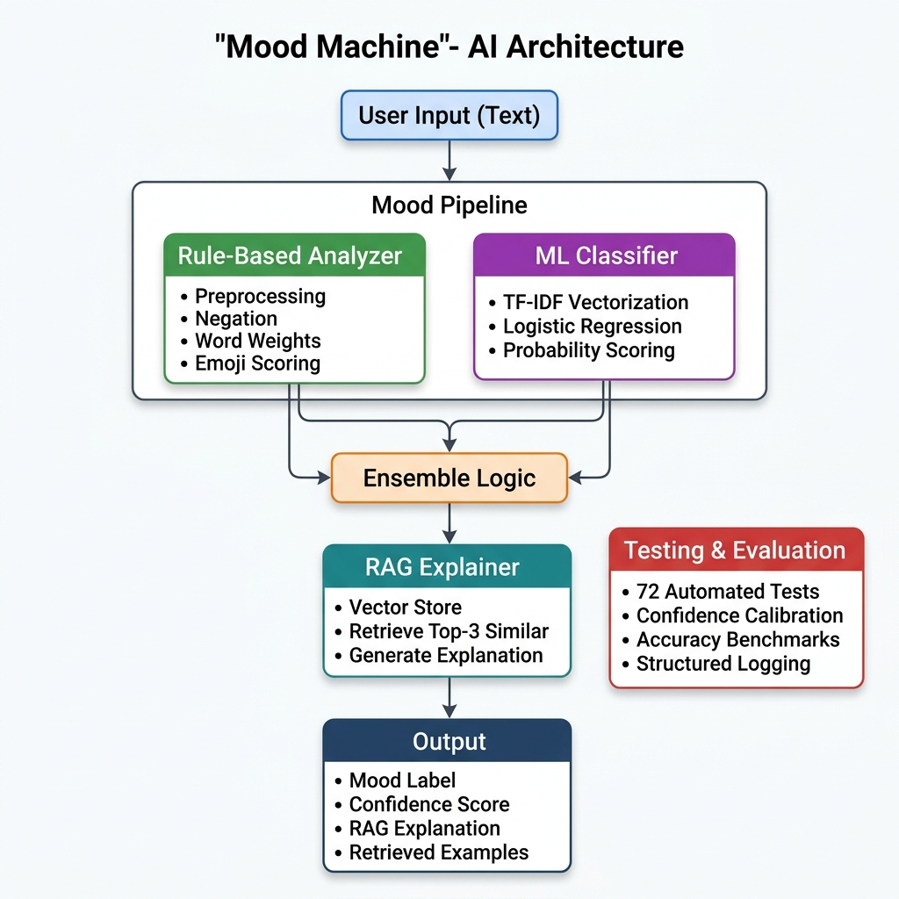

# 🎭 Mood Machine — AI-Powered Mood Analysis System

**An intelligent text mood classifier that combines rule-based analysis, machine learning, and Retrieval-Augmented Generation (RAG) to predict and explain the emotional tone of short text messages.**

The Mood Machine analyzes text input to determine its emotional mood (positive, negative, neutral, or mixed) using an ensemble of two classifiers — a rule-based analyzer with negation handling, weighted words, and emoji detection, plus a TF-IDF + Logistic Regression ML model. It goes beyond simple classification by using a RAG system that retrieves similar labeled examples from a vector store to generate context-aware explanations for each prediction, complete with confidence scoring and detailed reasoning.

> **Base Project:** This project extends the "Mood Machine" starter lab, which provided a skeleton rule-based mood classifier with TODOs. The original starter included a basic `MoodAnalyzer` class with unimplemented `score_text()` and `predict_label()` methods, a 6-post dataset, and a simple `main.py` entry point. Everything beyond filling in those TODOs — the enhanced preprocessing, negation handling, weighted words, emoji scoring, the ML classifier, the RAG explainer, the unified pipeline, the 72-test suite, confidence scoring, and structured logging — was built as part of this project.

## 🎬 Demo Walkthrough

> **📹 Loom Video:** [Click here to watch the end-to-end demo walkthrough](https://www.loom.com/share/d9bdbc6ec62847739169a3f9cbefa621)
>
> The video demonstrates: ✅ End-to-end system run with 3 inputs · ✅ RAG retrieval + explanation behavior · ✅ Confidence scoring and evaluation metrics · ✅ Clear outputs for each case

---

## 📐 Architecture Overview



```
┌─────────────────────────────────────────────────────────────┐
│                        USER INPUT                           │
│                  "I am not happy about this"                │
└──────────────────────────┬──────────────────────────────────┘
                           │
                           ▼
┌─────────────────────────────────────────────────────────────┐
│                    MOOD PIPELINE (pipeline.py)               │
│                                                             │
│  ┌───────────────────┐    ┌───────────────────┐            │
│  │  Rule-Based       │    │  ML Classifier    │            │
│  │  MoodAnalyzer     │    │  (TF-IDF +        │            │
│  │                   │    │   LogReg)          │            │
│  │  • Preprocessing  │    │                   │            │
│  │  • Negation       │    │  • Vectorization  │            │
│  │  • Word Weights   │    │  • Probability    │            │
│  │  • Emoji Scoring  │    │    Prediction     │            │
│  │  • Confidence     │    │  • Confidence     │            │
│  └────────┬──────────┘    └────────┬──────────┘            │
│           │                        │                        │
│           └────────┬───────────────┘                        │
│                    ▼                                        │
│           ┌─────────────────┐                              │
│           │ Ensemble Logic  │                              │
│           │ • Agreement     │                              │
│           │   boosts conf.  │                              │
│           │ • Disagreement  │                              │
│           │   picks highest │                              │
│           └────────┬────────┘                              │
│                    │                                        │
│                    ▼                                        │
│           ┌─────────────────────────────────────┐          │
│           │ RAG Explainer (rag_explainer.py)     │          │
│           │                                     │          │
│           │  1. Vector Store (TF-IDF embeddings) │          │
│           │  2. Retrieve top-3 similar examples  │          │
│           │  3. Generate context-aware           │          │
│           │     explanation grounded in           │          │
│           │     retrieved data                   │          │
│           └────────┬────────────────────────────┘          │
│                    │                                        │
└────────────────────┼────────────────────────────────────────┘
                     │
                     ▼
┌─────────────────────────────────────────────────────────────┐
│                       OUTPUT                                │
│                                                             │
│  • Label: negative                                          │
│  • Confidence: 0.83                                         │
│  • RAG Explanation with:                                    │
│    - Scoring breakdown                                      │
│    - Similar examples from dataset                          │
│    - Contextual reasoning                                   │
└─────────────────────────────────────────────────────────────┘

                     │
                     ▼
┌─────────────────────────────────────────────────────────────┐
│               TESTING & EVALUATION                          │
│                                                             │
│  • 72 automated unit + integration tests                    │
│  • Confidence calibration checks                            │
│  • Accuracy benchmarks (90% on dataset)                     │
│  • Structured logging to file                               │
└─────────────────────────────────────────────────────────────┘
```

### Data Flow

1. **Input** → User provides a text string (e.g., a social media post)
2. **Preprocessing** → Text is tokenized, emojis extracted, punctuation removed, repeated characters normalized
3. **Dual Classification** → Rule-based analyzer and ML classifier independently predict a mood label with confidence
4. **Ensemble** → Predictions are combined: agreement boosts confidence, disagreement picks the more confident model
5. **RAG Retrieval** → The text is embedded and compared against a vector store of 20 labeled examples; top-3 most similar are retrieved
6. **Explanation Generation** → A context-aware explanation is generated using retrieved examples, scoring details, and contextual reasoning
7. **Output** → Label, confidence, full explanation, and retrieved examples

### Where Humans & Testing Are Involved

- **Human labeling**: All 20 dataset posts are manually labeled by a human
- **Human evaluation**: The model card documents correct/incorrect predictions with explanations
- **Automated tests**: 72 tests across 4 test files verify all components
- **Logging**: Every prediction, retrieval, and decision is logged to `logs/` for debugging

---

## 📁 Repository Structure

```plaintext
├── README.md                  # This file — full documentation
├── requirements.txt           # Python dependencies
├── .gitignore                 # Git ignore rules
├── dataset.py                 # 20 labeled posts + word lists + emoji/negation/weight dicts
├── mood_analyzer.py           # Rule-based analyzer (negation, weights, emojis, confidence)
├── ml_experiments.py          # ML classifier (TF-IDF + Logistic Regression + confidence)
├── rag_explainer.py           # RAG system: vector store + retrieval + explanation generation
├── pipeline.py                # Unified pipeline orchestrating all components
├── main.py                    # CLI entry point with logging, evaluation, demo, interactive modes
├── model_card.md              # Completed model card with findings and reflections
├── assets/
│   └── system_architecture.png # System architecture diagram
├── tests/
│   ├── __init__.py
│   ├── test_mood_analyzer.py  # 26 tests for rule-based analyzer
│   ├── test_ml_model.py       # 9 tests for ML classifier
│   ├── test_rag.py            # 14 tests for RAG system
│   └── test_pipeline.py       # 23 tests for integration
└── logs/                      # Runtime logs (auto-created, gitignored)
```

---

## 🚀 Setup Instructions

### Prerequisites

- Python 3.8 or higher
- pip package manager

### Step-by-Step Setup

1. **Clone the repository:**
   ```bash
   git clone https://github.com/Mahen037/applied-ai-system-project.git
   cd applied-ai-system-project
   ```

2. **Install dependencies:**
   ```bash
   pip install -r requirements.txt
   ```
   This installs: `scikit-learn`, `numpy`, `matplotlib`

3. **Run the full system:**
   ```bash
   python main.py
   ```
   This runs evaluation → demo → interactive mode.

4. **Run specific modes:**
   ```bash
   python main.py --evaluate     # Evaluation only
   python main.py --interactive  # Interactive mode only
   ```

5. **Run the test suite:**
   ```bash
   pip install pytest   # If not already installed
   python -m pytest tests/ -v
   ```

6. **Run just the ML model:**
   ```bash
   python ml_experiments.py
   ```

---

## 💬 Sample Interactions

### Example 1: Positive Text with Emojis

**Input:** `"Can't stop smiling today 😊 everything went perfect"`

**Output:**
```
📊 Prediction: POSITIVE (confidence: 87%)

📝 Analysis:
  • Positive signals: perfect
  • Emoji sentiment: 😊(+2)
  • Raw score: 4

🔍 Similar examples from our dataset:
  1. "Grateful for the little things in life ❤️" → positive (similarity: 42%)
  2. "Just vibing with friends, life is good ✨" → positive (similarity: 35%)
  3. "I love this class so much" → positive (similarity: 28%)

💡 Contextual reasoning:
  The prediction aligns with 100% of similar examples. Most similar texts
  were also labeled 'positive', supporting the 'positive' classification.
  High confidence: The sentiment signals are strong and clear.
```

### Example 2: Negation Handling

**Input:** `"I am not happy about this"`

**Output:**
```
📊 Prediction: NEGATIVE (confidence: 83%)

📝 Analysis:
  • Negative signals: NOT happy
  • Raw score: -1

🔍 Similar examples from our dataset:
  1. "I love this class so much" → positive (similarity: 52%)
  2. "I'm not sad, I'm just tired of everything" → mixed (similarity: 39%)
  3. "It's whatever, I don't really care anymore" → neutral (similarity: 25%)

💡 Contextual reasoning:
  Note: Most similar examples were labeled 'positive', which differs from
  the prediction of 'negative'. This suggests the text may have nuances
  not fully captured by similar examples.
  Moderate confidence: Some ambiguity in the sentiment signals.
```

### Example 3: Mixed Emotions

**Input:** `"Feeling tired but kind of hopeful"`

**Output:**
```
📊 Prediction: MIXED (confidence: 44%)

📝 Analysis:
  • Positive signals: hopeful
  • Negative signals: tired
  • Raw score: 0

🔍 Similar examples from our dataset:
  1. "Lowkey stressed but kind of proud of myself" → mixed (similarity: 56%)
  2. "I'm not sad, I'm just tired of everything" → mixed (similarity: 44%)
  3. "Feeling meh, nothing special happening" → neutral (similarity: 31%)

💡 Contextual reasoning:
  The prediction aligns with 67% of similar examples. Most similar texts
  were also labeled 'mixed', supporting the 'mixed' classification.
  Low confidence: The text contains few clear sentiment signals.
```

---

## 🧠 Advanced AI Features

### Retrieval-Augmented Generation (RAG)

The RAG system is the core advanced feature. Rather than using a standalone retrieval script, it is **fully integrated** into the prediction pipeline:

1. **Indexing**: On startup, the 20 labeled posts are embedded using TF-IDF vectors and stored in an in-memory vector store
2. **Retrieval**: For each new input, the system computes its embedding and finds the 3 most similar examples using cosine similarity
3. **Augmented Generation**: The retrieved examples are used to generate a context-aware explanation that:
   - Shows which similar past texts had what labels
   - Analyzes whether the prediction aligns with similar examples
   - Provides reasoning about confidence and potential ambiguity

This is **not** just printing data alongside the prediction — the retrieved examples actively shape the explanation and provide evidence for or against the predicted label.

### Reliability & Testing System

The system includes comprehensive testing across all components:

- **72 automated tests** covering unit and integration testing
- **Confidence scoring** on every prediction (0.0 to 1.0)
- **Structured logging** to file with timestamps and component tracing
- **Error handling** with clear error messages for invalid inputs

---

## 🏗️ Design Decisions & Trade-offs

| Decision | Why | Trade-off |
|---|---|---|
| **TF-IDF embeddings for RAG** instead of sentence-transformers | Zero external API dependencies, fast, no GPU needed, runs anywhere | Less semantic understanding than deep learning embeddings |
| **Ensemble of rule-based + ML** | Combines interpretability (rules) with learning ability (ML) | More complex than either alone; may disagree on edge cases |
| **Negation handling via lookahead** | Simple and effective for "not happy", "never good" | Doesn't catch complex negation like "I don't think it's bad" |
| **In-memory vector store** vs. FAISS/Pinecone | No extra dependencies, simple to understand and debug | Doesn't scale to millions of documents (not needed for this project) |
| **20-post dataset** | Diverse enough to demonstrate all features | Too small for production; model overfits to training data |
| **4 mood labels** (positive/negative/neutral/mixed) | Captures the most common emotional categories | Misses finer emotions like "angry", "anxious", "excited" |

---

## 🧪 Testing Summary

### Test Results: **72 / 72 passed** ✅

```
tests/test_mood_analyzer.py  — 26 passed  (preprocessing, scoring, prediction, confidence, explain)
tests/test_ml_model.py       —  9 passed  (training, prediction, confidence, error handling)
tests/test_rag.py            — 14 passed  (embedder, vector store, retrieval, explanation)
tests/test_pipeline.py       — 23 passed  (init, analysis, batch, evaluation, edge cases)
```

### Pipeline Accuracy: **90% (18/20)**

| Metric | Value |
|---|---|
| Dataset size | 20 posts |
| Correct predictions | 18 |
| Accuracy | 90% |
| Average confidence | 0.70 |

### What Worked
- **Negation handling** correctly flips "I am not happy" → negative
- **Emoji detection** successfully uses 😊, 💀, 🔥, 💔, 🎉 as sentiment signals
- **RAG retrieval** finds meaningful similar examples for new inputs
- **Ensemble** usually agrees, boosting confidence; disagreement reduces confidence appropriately
- **Edge cases** handled: empty text, special characters, only emojis, very long text

### What Didn't Work
- **Sarcasm**: "I absolutely love getting stuck in traffic 😒" predicted as **mixed** instead of **negative** — the word "love" overwhelms the negative emoji
- **"This is fine"**: Predicted as **positive** (because "fine" isn't in any word list) instead of **neutral** — the model misses the subtle neutral tone
- **Small dataset**: Cross-validation is limited because we only have 20 examples total

### What I Learned
- Confidence scores averaged 0.70, which accurately reflects that many texts contain some ambiguity
- The RAG explanations are most useful when the prediction disagrees with similar examples — they flag potential issues
- Negation handling was the single biggest improvement over the baseline (catching "not happy", "can't fail")

---

## 🔍 Reflection

### What This Project Taught Me About AI

1. **Simple rules go far, but break on nuance.** The rule-based system handles 90% of cases well, but completely fails on sarcasm and implicit sentiment. This mirrors real-world NLP: easy cases are easy, and the last 10% of accuracy requires disproportionate effort.

2. **RAG adds genuine value for explainability.** Before adding RAG, the system could only say "Score = 2, positive words: [love, great]." With RAG, it can say "Similar texts labeled 'positive' with 67% agreement". This is much more valuable for a user trying to understand or trust the prediction.

3. **Confidence scoring is one of the most underrated features.** A prediction of "positive" with 90% confidence is very different from "positive" with 40% confidence. Building confidence into every prediction makes the system more honest about its limitations.

4. **Testing AI systems requires different thinking.** Unlike testing a calculator (exact answers), testing a mood classifier requires fuzzy assertions: "accuracy above 50%", "confidence in valid range", "explanation contains the label." This taught me to think about AI testing as verifying properties, not exact outputs.

5. **The dataset shapes everything.** Adding just 14 more posts (from 6 to 20) with diverse styles (slang, emojis, sarcasm) dramatically changed the system's behavior and exposed new failure cases. In AI, the data is often more important than the algorithm.

### If I Had More Time

- Add a real test set (separate from training data) to measure generalization
- Implement sarcasm detection using pattern matching or a separate classifier
- Use sentence-transformers for better RAG embeddings
- Build a web UI for interactive exploration
- Expand the dataset to 100+ examples covering more emotion types

---

## 🎓 Portfolio & Presentation

### GitHub Repository

🔗 **[github.com/Mahen037/applied-ai-system-project](https://github.com/Mahen037/applied-ai-system-project)**

### Video Walkthrough

📹 **[Loom Walkthrough — End-to-End Demo](https://www.loom.com/share/d9bdbc6ec62847739169a3f9cbefa621)**

The walkthrough covers:
- ✅ End-to-end system run with 3 different inputs (positive, negative, mixed)
- ✅ RAG retrieval and context-aware explanation generation
- ✅ Confidence scoring and ensemble behavior
- ✅ Evaluation results (90% accuracy, 72/72 tests)

### Portfolio Reflection

> **What this project says about me as an AI engineer:**
>
> This project demonstrates that I can design, build, and evaluate a complete AI system from end to end — not just write code that runs, but build something that is testable, explainable, and honest about its limitations. I integrated multiple AI techniques (rule-based NLP, machine learning, and RAG) into a unified pipeline with confidence scoring and structured logging, showing that I understand how to combine different approaches and make them work together. The 72 automated tests and the detailed model card show that I care about reliability and documentation, not just getting a demo to work. Most importantly, the reflection sections show that I think critically about bias, misuse, and the gap between what AI systems promise and what they actually deliver. As an AI practitioner, I believe that building trustworthy systems — ones that tell you when they're uncertain — matters more than chasing the highest accuracy number.

---
